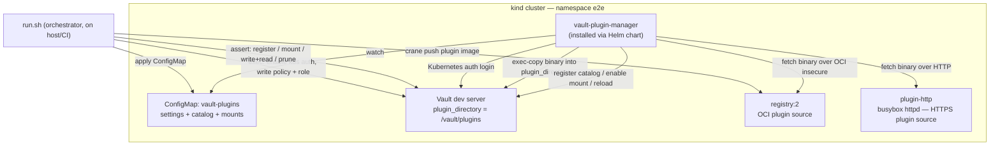
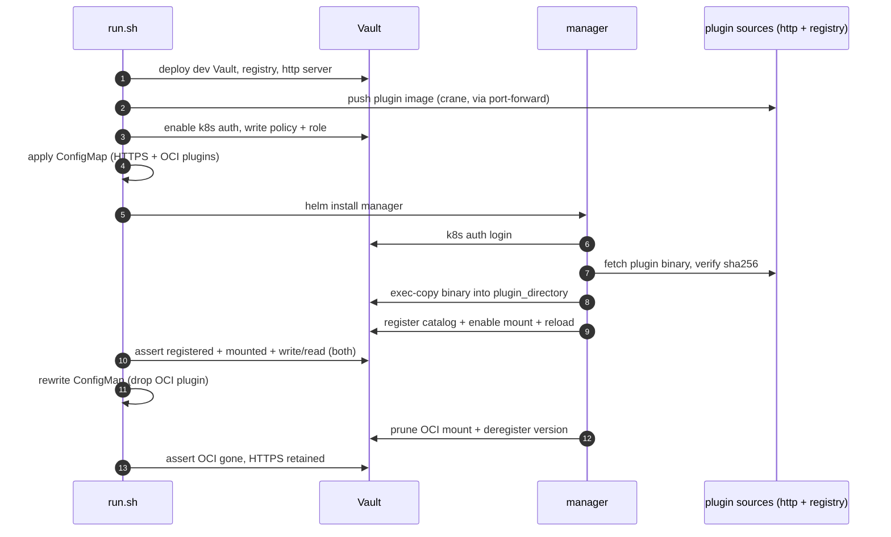

# End-to-end test

`run.sh` exercises the whole manager against a real Vault on a `kind` cluster:

1. Creates a kind cluster and an `e2e` namespace.
2. Builds & loads two images: the **manager** (`Dockerfile.manager`) and the
   **test plugin** (`testplugin/` — a minimal real Vault secrets engine that
   also serves its own binary over HTTP and carries it at `/plugin/foo` for OCI).
3. Deploys a dev **Vault** (`-dev-plugin-dir=/vault/plugins`), an in-cluster OCI
   **registry**, and an HTTP **plugin server**; pushes the plugin image to the
   registry.
4. Configures Vault: Kubernetes auth, the manager policy (see repo README), and a
   role bound to the manager's ServiceAccount.
5. Applies a ConfigMap declaring two plugins — one via **HTTPS** (`source.url`)
   and one via **OCI** (`source.image`+`path`) — and installs the manager with
   the Helm chart (`ociInsecure=true` for the plain-HTTP registry).
6. Asserts: both plugins registered, both mounts enabled, and `write`/`read` of a
   secret works through each. Then removes the OCI entry and asserts prune
   disabled the mount + deregistered the version while the HTTPS mount survived.

## How it fits together

Components (all in namespace `e2e`) and who talks to whom. `run.sh` sets the
stage from the host; the **manager** then does the real work on its own.



Ordered flow of one run:



The same image backs both plugin sources: `testplugin/Dockerfile` bakes the
binary at `/www/foo` (served by httpd) **and** `/plugin/foo` (read out of the
image rootfs by the OCI fetcher), so one sha256 covers both.

## Run it locally

Requires `docker`, `kind`, `kubectl`, `helm`.

```sh
test/e2e/run.sh 1.18.5      # or any hashicorp/vault tag
KEEP=1 test/e2e/run.sh      # leave the cluster up for inspection on exit
```

## CI

`.github/workflows/e2e.yml` runs `run.sh` across a matrix of Vault versions.
Edit the `matrix.vault` list to change coverage.

## Notes

- The test plugin is a **separate Go module** so the Vault SDK stays out of the
  manager's dependency graph.
- It uses plugin protocol v5 (`ServeMultiplex`), so the matrix should stay on
  Vault versions that support it (~1.12+).
